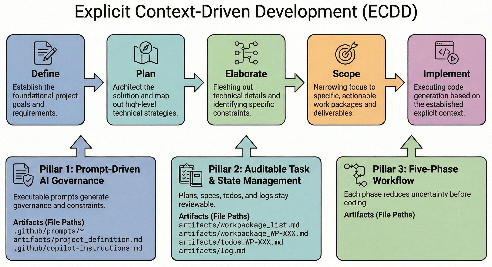
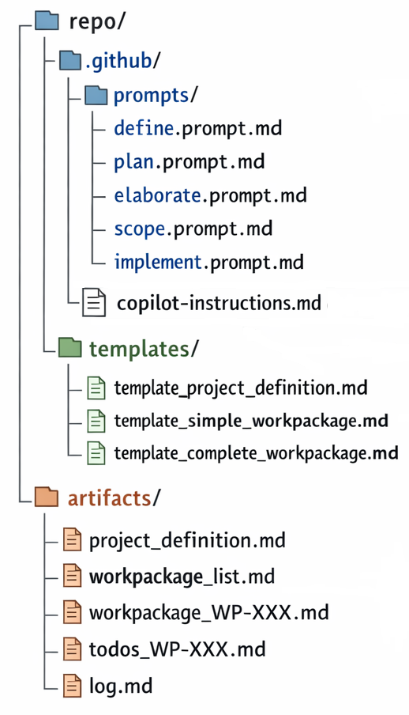
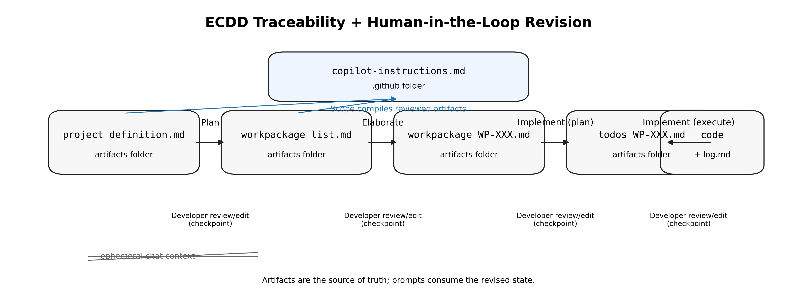

# Explicit Context-Driven Development: From Vibe Coding to Verifiable Workflows in AI-Augmented Software Engineering

# Abstract

AI-assisted programming tools can accelerate delivery, but informal "vibe coding" with large language models (LLMs) often yields architectural drift, context loss, and weak traceability as projects scale. We address this gap with Explicit Context-Driven Development (ECDD), a reusable methodology that treats prompts, templates, and project context as first-class, version-controlled artifacts rather than transient chat history. ECDD is organized around three pillars: (i) Prompt-Driven AI Governance, (ii) Auditable Task & State Management, and (iii) a Five-Phase Workflow (Define, Plan, Elaborate, Scope, Implement). Operationally, executable prompt contracts guide structured developer-AI interaction, fill editable Markdown templates, and generate persistent artifacts such as `project_definition.md`, `workpackage_list.md`, `workpackage_WP-XXX.md`, and `log.md` (in an artifacts folder), plus tool-scoped instructions such as `copilot-instructions.md`. Because these artifacts live in the repository, they can be inspected, diffed, and reviewed like code, decoupling project state from ephemeral chat windows. After each phase, developers review and can revise the artifacts; subsequent prompts consume the revised state, enabling deterministic propagation of decisions and standards. We hypothesize that this artifact-centric workflow can strengthen auditability and reduce context drift across planning, specification, and implementation, offering a practical alternative to ad hoc AI-assisted development for both practitioners and researchers.

# Keywords

Explicit Context-Driven Development (ECDD), AI-Assisted Software Engineering, Prompt-Driven AI Governance, Human-AI Collaboration, Auditable Development Workflows, Version-Controlled Context Artifacts.

# I. INTRODUCTION

AI coding tools can accelerate software delivery, but they also introduce coordination and quality risks. Modern large language models (LLMs) can generate substantial code from short prompts, which makes informal "vibe coding" attractive for fast iteration. Empirical studies of AI-assisted programming report perceived productivity impacts and benefits in some settings [2]. Other studies surface code quality concerns [3] and security risks in AI-generated code, including empirical evidence of security weaknesses in Copilot-generated code used in GitHub projects [4] and large-scale comparative analyses across LLMs [12]. As projects grow, this informal style often leads to architectural drift, inconsistent conventions, and weak traceability between intent and implementation.

A practical alternative is to externalize context from transient chat into repository artifacts that can be reviewed, diffed, and maintained with code. In this view, prompts are not ad hoc instructions but durable technical assets that encode goals, constraints, architecture, and coding rules for both developers and AI tools.

We propose **Explicit Context-Driven Development (ECDD)**, a methodology for AI-assisted development built around a **Five-Phase Workflow** (*Define, Plan, Elaborate, Scope, and Implement*; see Fig. 1). ECDD structures human-AI collaboration through three pillars:

1. **Prompt-Driven AI Governance**: executable prompts and durable governance documents capture project goals, architectural constraints, and coding standards so AI assistance behaves consistently across sessions.
2. **Auditable Task & State Management**: work decomposition and execution history are captured in reviewable artifacts (roadmaps, work package specifications, stepwise checklists, and append-only logs) to preserve traceability from intent to implementation.
3. **Five-Phase Workflow**: each phase reduces uncertainty by transforming free-form intent into template-shaped, reviewable artifacts before coding begins.

This "copilot, not autopilot" stance preserves human oversight while retaining AI speed advantages. ECDD is intended to improve alignment across planning, specification, and implementation, and to help reduce context loss across sessions.

Fig. 1 summarizes ECDD as a five-phase pipeline (Define, Plan, Elaborate, Scope, Implement) supported by the three pillars and their associated intermediate artifacts, making explicit how governance prompts, work packages, and append-only logs replace ephemeral chat context during development.

Section II introduces the concrete repository layout and the corresponding prompt, template, and artifact set (Fig. 2).

This paper makes three contributions. First, we define ECDD as a concrete methodology grounded in explicit, version-controlled context artifacts. Second, we present reusable workflows and canonical prompt/template assets that operationalize the methodology in practice. Third, we show how the approach decouples project state from any single AI interface, enabling IDE-agnostic adoption (e.g., GitHub Copilot, Cursor, Windsurf).

The remainder of the paper is organized as follows. Section II introduces ECDD and details the prompt-, template-, and artifact-based workflow. Section III provides a brief running example that illustrates the artifact chain end-to-end. Section IV discusses practical lessons, limitations, and threats to validity. Section V concludes and outlines future research directions, including an evaluation agenda.


*Fig. 1. ECDD workflow: five phases (Define, Plan, Elaborate, Scope, Implement) and the three supporting pillars with key artifacts.*

# II. EXPLICIT CONTEXT-DRIVEN DEVELOPMENT (ECDD)

Explicit Context-Driven Development (ECDD) is a methodology for AI-assisted software development that treats prompts and project context as first-class, version-controlled artifacts. Rather than relying on whichever files are currently visible in an IDE or whatever a model happens to remember from a chat session, ECDD makes context explicit and durable in the repository. Concretely, ECDD is delivered as (i) executable prompts under `.github/prompts/`, (ii) Markdown templates under `templates/` that act as lightweight schemas, and (iii) generated artifacts under `artifacts/` that capture the evolving project state (Fig. 2).

This repository layout is intentional (Fig. 2): `.github/prompts/` is the editable governance and workflow entry point (teams adjust prompting and interview behavior here), `templates/` is the editable contract layer (teams encode project- and company-specific standards in the artifact structure), and `artifacts/` is the persistent project state (generated by agents but explicitly reviewed and edited by developers as the source of truth). When `templates/` or `artifacts/` evolve, teams re-run the Scope prompt to regenerate `copilot-instructions.md` in the `.github/` folder, ensuring downstream coding agents consistently receive the current standards and decisions. This structure operationalizes "contracts over conversation" and supports the traceability chain described below.


*Fig. 2. Reference ECDD repository structure (prompts, templates, artifacts) and edit points.*

In the remainder of this section, we describe ECDD at increasing levels of concreteness: Section II.A summarizes the design principles, Section II.B specifies the executable prompt contracts, Section II.C defines the artifact model and traceability chain, and Section II.D walks through the reference workflow end-to-end.

## A. Design Principles

ECDD is guided by the following design principles:

1. **Repository-as-source-of-truth**: the project definition, plan, specs, and logs live in files that can be diffed, reviewed, and versioned.
2. **Contracts over conversation**: prompts specify what to read and what to produce; templates constrain intermediate artifacts so outputs remain consistent, reviewable, and reusable. Because `templates/` are version-controlled, teams can update them to reflect project requirements or company standards, and agents will fill the new structure instead of producing unconstrained free-text documents.
3. **Human-in-the-loop checkpoints**: after each phase, developers review (and may edit) artifacts before moving forward.
4. **Incremental, resumable execution**: implementation is decomposed into checklists; progress is tracked explicitly rather than inferred from chat history.
5. **IDE-agnostic by default, IDE-integrated when available**: the same artifacts can be used in any AI-IDE, while `copilot-instructions.md` in the `.github/` folder provides an integration point for GitHub Copilot in VS Code [1].

Table 1 contrasts these principles with ad hoc "vibe coding", highlighting how ECDD systematically addresses the risks of architectural drift and lost context.

| Feature                  | Ad hoc "Vibe Coding"                   | ECDD (Proposed)                             |
| :----------------------- | :------------------------------------- | :------------------------------------------ |
| **Context Source** | Ephemeral chat history (lost on reset) | Version-controlled repository artifacts     |
| **Governance**     | None (user-dependent)                  | Executable Prompt Contracts & Templates     |
| **Consistency**    | High variability (styles drift)        | Schema-enforced (strict template adherence) |
| **Traceability**   | Implicit / nonexistent                 | Explicit chain (Definition -> Spec -> Log)  |
| **Collab. Model**  | Single-player (hard to share context)  | Multi-player (Git-reviewable state)         |

*Table 1. Comparison of ad hoc "vibe coding" versus Explicit Context-Driven Development (ECDD), showing how persistent artifacts and schemas replace ephemeral chat context.*

## B. Executable Prompts as Workflow Contracts

The prompts in `.github/prompts/` are designed as small, executable workflow definitions. Each prompt begins with machine-readable metadata (YAML front matter) that declares its purpose, role, and I/O contract (e.g., `input_files` and `output_file`). The prompt body then specifies:

1. **Strict template adherence**: the agent must fill the referenced template structure exactly, treating templates as schemas that reduce variability.
2. **Interactive clarification protocol**: when critical information is missing, the agent asks questions one at a time, offers 2-4 options with brief trade-offs and a recommendation, and waits for an answer before continuing.
3. **Explicit completion statements**: each phase ends with a predictable handoff message that points to the created artifact and the next prompt to run.

Template adherence is a core mechanism for controlling quality. It constrains the model's output space for intermediate artifacts, reduces stylistic drift across sessions, and supports lightweight automation (e.g., consistent checklists and review practices). Importantly, evolving templates is itself auditable: updates to `templates/` can be reviewed like code, providing a systematic way to encode project- or company-specific standards beyond one-off prompting.

This design makes prompt execution auditable: changes to prompts/templates are versioned like code, and changes to artifacts are reviewed like specifications. In our reference workflow, executing these prompts produces a small set of structured intermediate artifacts that carry project state across sessions.

In the reference prompt set (Fig. 2), each prompt has a specific goal, declared inputs, and a defined output. Table 2 summarizes these contracts at a glance; we then describe each prompt's behavior in more detail.

| Prompt    | Goal (short)                             | Template                                                | Key inputs                                                                                       | Outputs                                                   | Notable behavior                                       |
| --------- | ---------------------------------------- | ------------------------------------------------------- | ------------------------------------------------------------------------------------------------ | --------------------------------------------------------- | ------------------------------------------------------ |
| Define    | Establish project intent and constraints | `template_project_definition.md` (templates folder)   | Developer description + clarifications                                                           | `project_definition.md` (artifacts folder)              | Clarify one question at a time; strict template fill   |
| Plan      | Create dependency-aware roadmap          | `template_simple_workpackage.md` (templates folder)   | `project_definition.md` (artifacts folder)                                                     | `workpackage_list.md` (artifacts folder)                | Coverage + sequencing; template-shaped WPs             |
| Elaborate | Specify one WP for implementation        | `template_complete_workpackage.md` (templates folder) | `project_definition.md`, `workpackage_list.md` (artifacts folder) + WP ID (e.g., `WP-001`) | `workpackage_WP-XXX.md` (artifacts folder)              | Single-WP focus; testable acceptance + verification    |
| Scope     | Generate coding-agent guidance           | None                                                    | Current artifacts (definition, roadmap, specs)                                                   | `copilot-instructions.md` (`.github/` folder)         | Concise, actionable sections; clarify only if blocked  |
| Implement | Execute one WP with audit trail          | None                                                    | `workpackage_WP-XXX.md`, `log.md` (artifacts folder)                                         | `todos_WP-XXX.md` (artifacts folder); append `log.md` | Resumable checklist; verify each step; append-only log |

*Table 2. Summary of the five ECDD executable prompts, including their templates, primary inputs/outputs, and notable behavioral constraints.*

Crucially, ECDD assumes that prompt execution is followed by an explicit developer review checkpoint, operationalizing the **Human-in-the-loop checkpoints** design principle (Section II.A). After each prompt generates or updates an artifact, the developer can inspect and edit it (and commit changes) before proceeding. Subsequent prompts then consume the revised artifacts as their starting point, so corrections to scope, standards, dependencies, or specifications propagate deterministically through later planning and implementation steps.

**Define:** The Define prompt (`define.prompt.md` in the prompts folder) elicits and formalizes scope, goals, architecture, constraints, and risks into a single source-of-truth project definition. It fills the project-definition template (`template_project_definition.md` in the templates folder) using the developer's project description and clarification answers, following a one-question-at-a-time protocol with options and recommendations. The output is saved to `project_definition.md` in the artifacts folder.

**Plan:** The Plan prompt (`plan.prompt.md` in the prompts folder) decomposes the project definition into a dependency-aware roadmap of Work Packages with stable IDs. Using `project_definition.md` from the artifacts folder and the simple work-package template (`template_simple_workpackage.md` in the templates folder), it enforces implementable granularity and coverage of the defined scope, and asks clarifying questions only when scope boundaries or dependencies affect sequencing. The output is saved to `workpackage_list.md` in the artifacts folder.

**Elaborate:** The Elaborate prompt (`elaborate.prompt.md` in the prompts folder) expands one selected work package into an executable technical specification suitable for supervised implementation. Given `project_definition.md` and `workpackage_list.md` from the artifacts folder, the detailed work-package template (`template_complete_workpackage.md` in the templates folder), and a work package identifier (e.g., `WP-001`), it produces a single-WP spec with testable acceptance criteria, technical contracts, stepwise implementation guidance, and verification requirements. The output is saved to `workpackage_WP-XXX.md` in the artifacts folder (e.g., `workpackage_WP-001.md`).

**Scope:** The Scope prompt (`scope.prompt.md` in the prompts folder) compiles the current project artifacts into actionable, tool-consumable coding guidance. It reads the current project definition, roadmap, and any available detailed work-package specifications from the artifacts folder and generates `copilot-instructions.md` in the `.github/` folder using a prescribed section structure (no separate template).

**Implement:** The Implement prompt (`implement.prompt.md` in the prompts folder) implements a single work package under developer oversight with explicit progress tracking and an auditable change record. It uses the current project definition and roadmap, the selected detailed work-package specification (`workpackage_WP-XXX.md` in the artifacts folder), and (if present) `log.md` to create or resume a granular checklist (`todos_WP-XXX.md` in the artifacts folder), verify steps atomically, and append a detailed entry to `log.md` without overwriting history.

### B.1 Prompt Contract Schema 

In ECDD, a prompt file is treated as a small, executable "workflow contract." In this repository, each of the five prompts begins with YAML front matter that declares a stable identifier and an explicit I/O contract. The most common fields are `name`, `description`, `version`, `role`, `input_files`, and an output declaration. Table 3 summarizes the intended semantics.

In practice, prompt ecosystems and IDE integrations vary, and so do implementation details. Our reference prompts demonstrate two small inconsistencies that are important to call out explicitly: some prompts declare a single `output_file`, while others declare an `output_files` list; and work-package-specific prompts use parameter placeholders for a WP identifier (e.g., a `workPackageId`), but the exact placeholder notation can differ across tools. In the remainder of this paper, we use `WP-XXX` as a tool-agnostic placeholder for a work package identifier and recommend normalizing outputs as a list for consistency.

| Field            | Meaning                  | Example values (from this repo)              | Constraints / notes                                   |
| ---------------- | ------------------------ | -------------------------------------------- | ----------------------------------------------------- |
| `name`         | Stable prompt identifier | `define-project`, `plan-roadmap`         | Should be unique within the prompts folder            |
| `description`  | One-sentence intent      | "Generates a high-level roadmap..."          | Human readable; should match actual behavior          |
| `version`      | Prompt contract version  | `1.0.0`                                    | Bump when I/O or constraints change materially        |
| `role`         | Agent role framing       | "Software Architect"                         | Should be consistent with expected outputs            |
| `input_files`  | Declared inputs          | `project_definition.md` (artifacts folder) | Must include all artifacts/templates the prompt reads |
| `output_file`  | Single output (legacy)   | `workpackage_list.md` (artifacts folder)   | Prefer `output_files` for normalization             |
| `output_files` | Multiple outputs         | `todos_WP-XXX.md` + append `log.md`      | Useful when a prompt writes more than one file        |

*Table 3. Prompt front matter fields and their semantics. While our reference prompts use `output_file` and `output_files` inconsistently, a normalized schema improves tooling and reviewability.*

The following snippet illustrates a normalized contract style (outputs declared as a list), keeping the remainder of the prompt body as the "executable" specification of behavior:

```yaml
---
name: plan-roadmap
version: 1.0.0
role: Software Architect
input_files: [artifacts/project_definition.md, templates/template_simple_workpackage.md]
output_files: [artifacts/workpackage_list.md]
---
```

### B.2 Execution Semantics 

Beyond I/O, ECDD prompts encode execution semantics that are designed to make interactions predictable and auditable. The first is a clarification protocol: when a prompt detects missing information that would materially affect downstream work, it asks one question at a time, provides a small set of options with trade-offs and a recommended default, and waits for the developer's response. The developer can then directly revise artifacts before the next prompt consumes them, turning clarification into a version-controlled correction rather than an ephemeral chat detour.

The second is an explicit completion statement. Each prompt ends by stating which artifact(s) were created or updated and which prompt should be executed next. This acts as a lightweight handoff mechanism that reduces context loss, especially when developers switch tools or resume work later.

### B.3 Resource Binding Mechanism 

The reference prompts also include a pragmatic binding mechanism for inputs: `#file:` references that point to the relevant templates and artifacts (e.g., `#file:templates/template_project_definition.md`). In IDEs that support file-aware prompts, these directives can be resolved automatically; in simpler chat interfaces, developers can approximate the same behavior by attaching the referenced files or pasting their contents. The key point is not the specific directive syntax, but the contract principle: prompts declare what must be read and what must be produced, so intermediate artifacts remain consistent across tools and sessions.

## C. Artifact Model and Traceability

Prompt execution produces a small set of human-readable artifacts with clear roles and naming conventions:

1. **Project definition**: `project_definition.md` in the artifacts folder captures MVP scope, architecture, constraints, and risks (generated from `template_project_definition.md` in the templates folder).
2. **Roadmap (work packages)**: `workpackage_list.md` in the artifacts folder decomposes the project into Work Packages (WPs) with dependencies and priorities (generated using `template_simple_workpackage.md` in the templates folder). Each WP has a stable identifier such as `WP-001`.
3. **Detailed WP specification**: `workpackage_WP-XXX.md` in the artifacts folder expands a single WP into an executable spec with acceptance criteria, technical contracts, implementation steps, and test requirements (generated from `template_complete_workpackage.md` in the templates folder).
4. **Execution checklist**: `todos_WP-XXX.md` in the artifacts folder tracks stepwise implementation as a Markdown checklist (checked items `[x]` vs unchecked `[ ]`), enabling resumable work across sessions.
5. **Append-only log**: `log.md` in the artifacts folder records what changed, where, and why, so future agents can avoid rework and maintain continuity when switching work packages.
6. **AI instructions (scoped context)**: `copilot-instructions.md` in the `.github/` folder summarizes project context and coding guidelines for coding agents, derived from the current artifacts.

Templates can be understood as lightweight schemas for intermediate artifacts. For example, the complete work package template requires explicit acceptance criteria, files-to-touch guidance, and verification steps. These fields are deliberately "quality gates" that reduce omission risk compared to free-form documents produced during vibe coding, and they also make artifact reviews more systematic (e.g., reviewers can scan for missing acceptance criteria or testing requirements).

Template evolution is itself a workflow. Teams can edit templates to encode project- and company-specific standards, re-run the relevant prompt(s) to regenerate artifacts in the updated structure, and review the resulting diffs like code. This operationalizes the **Human-in-the-loop checkpoints** design principle: revisions to templates and artifacts become explicit, auditable changes that deterministically propagate into subsequent planning and implementation steps.

| Template-shaped element                       | Where it appears          | Risk mitigated (relative to free-form artifacts)                             |
| --------------------------------------------- | ------------------------- | ---------------------------------------------------------------------------- |
| In-scope / out-of-scope boundaries            | `project_definition.md` | Prevents scope creep and reduces contradictory implementations               |
| Dependencies and effort/priority fields       | `workpackage_list.md`   | Reduces sequencing errors and makes assumptions explicit                     |
| Acceptance criteria checklist                 | `workpackage_WP-XXX.md` | Prevents under-specification and provides a reviewable definition of done    |
| Files-to-create/modify list                   | `workpackage_WP-XXX.md` | Reduces architectural drift and accidental scatter across the codebase       |
| Testing requirements + verification checklist | `workpackage_WP-XXX.md` | Reduces "done without tests" failure modes; supports repeatable verification |
| Append-only change log structure              | `log.md`                | Improves post-hoc auditability and continuity across sessions/tools          |

*Table 4. Examples of how template-shaped fields act as lightweight quality controls, reducing variability and omission risk compared to free-form vibe coding artifacts.*

Templates are intentionally editable. Teams can tailor the structure of intermediate artifacts to their domain and governance needs (e.g., adding security checklists, test strategy fields, performance budgets, or links to ADRs) and encode organization-specific definitions of "done." Because agents are instructed to adhere strictly to the templates folder, updating a template changes the contract for subsequent artifacts in a controlled, reviewable way. Compared to free-form artifact generation in vibe coding, template-driven artifacts can reduce variability and help prevent omission of critical fields such as acceptance criteria and verification steps, which is intended to improve maintainability and overall software quality. Related work also shows that prompt engineering and fine-tuning can materially affect LLM-based automation performance in software engineering tasks such as automated code review [13].

Together, these artifacts form a traceability chain from intent to code: `project_definition.md` -> `workpackage_list.md` -> `workpackage_WP-XXX.md` -> `todos_WP-XXX.md` -> implementation + `log.md` (with the chain stored and reviewed under the artifacts folder).

Fig. 3 visualizes this traceability chain and highlights the deliberate human-in-the-loop revision checkpoints between phases.


*Fig. 3. Traceability chain and human-in-the-loop revision checkpoints: each phase produces a reviewable artifact, developers can revise it in version control, and subsequent prompts consume the revised state rather than relying on ephemeral chat memory.*

## D. Workflow Instantiation in Practice

This subsection describes how a developer instantiates ECDD in a repository organized as in Fig. 2. The workflow is executed by running the five prompts in sequence (Table 2), with a deliberate review checkpoint after each step (Section II.A). The practical goal is to replace implicit chat memory with a deterministic handoff: each prompt reads the current repository state, produces or updates a concrete artifact, and hands control back to the developer for validation and (optional) edits before the next step consumes that artifact.

The workflow is intentionally iterative rather than strictly linear. When scope changes, the developer can revise `project_definition.md` and re-run Plan to regenerate the roadmap; when standards evolve, the developer can update a template and re-run the relevant prompt so subsequent artifacts conform to the updated structure; when guidance for coding agents needs to be refreshed, Scope can be re-run to regenerate `copilot-instructions.md` from the current artifacts. These loops operationalize "contracts over conversation" by making the repository the place where decisions are corrected and propagated.

1. **Define:** Run the Define prompt (`define.prompt.md` in the prompts folder). The agent interviews the developer to resolve critical ambiguities and fills `template_project_definition.md` (templates folder). The output is saved to `project_definition.md` in the artifacts folder and reviewed/edited by the developer before proceeding.
2. **Plan:** Run the Plan prompt (`plan.prompt.md` in the prompts folder). Using the (potentially revised) `project_definition.md` and `template_simple_workpackage.md`, the agent produces a dependency-aware roadmap with stable WP identifiers (e.g., `WP-001`). The output is saved to `workpackage_list.md` in the artifacts folder; the developer reviews and may revise the roadmap before Elaborate consumes it.
3. **Elaborate:** Run the Elaborate prompt (`elaborate.prompt.md` in the prompts folder) for a selected WP. Using the (potentially revised) `project_definition.md` and `workpackage_list.md`, plus the detailed template (`template_complete_workpackage.md`), the agent produces `workpackage_WP-XXX.md` in the artifacts folder with acceptance criteria, technical contracts, file-level guidance, and verification requirements. The developer reviews and may revise this specification before implementation; the revised spec becomes the authoritative input to Implement.
4. **Scope:** Run the Scope prompt (`scope.prompt.md` in the prompts folder). The agent compiles the current, developer-reviewed artifacts into `copilot-instructions.md` in the `.github/` folder, creating a tool-consumable context package that keeps coding agents aligned with the latest decisions and standards. If the developer edits artifacts or templates, Scope can be re-run to regenerate this guidance from the updated state.
5. **Implement:** Run the Implement prompt (`implement.prompt.md` in the prompts folder) for a selected WP. The agent executes the (developer-approved) `workpackage_WP-XXX.md` specification in small, verifiable steps, tracking progress in `todos_WP-XXX.md` (artifacts folder) and recording an append-only history in `log.md` (artifacts folder). If the developer revises the spec or checklist mid-flight, implementation continues from the updated artifacts rather than relying on chat history.

In combination, these steps realize the traceability chain defined in Section II.C and keep the developer in control: changes are proposed by agents, validated through artifact review, and recorded in version control as part of the software system's evolving design. This human-in-the-loop artifact revision is a deliberate contrast to vibe coding, where plans and constraints typically remain implicit in free-text prompts or ephemeral chat memory and cannot be systematically reviewed, corrected, and propagated forward.

# III. RUNNING EXAMPLE (WALKTHROUGH)

This section provides a lightweight, method-only walkthrough that illustrates how the artifacts and prompts described in Section II interact in practice. The example uses a small web application, "AI Concepts Dictionary": a user enters an AI concept and the system returns a structured definition, short examples, and related resources. The specific domain is incidental; the goal is to show the ECDD artifact chain and the human-in-the-loop revision checkpoints that replace reliance on chat memory.

**Define (creates a project definition):** After running the Define prompt, the agent produces a first draft of `project_definition.md` in the artifacts folder. The developer reviews and may revise it before planning continues. The excerpt below is illustrative and abridged:

```markdown
# Project Definition (MVP)

## 1. Project Essentials

**Project Name:** AI Concepts Dictionary
**What does this project do?** A web app that returns structured definitions, examples, and resources for AI concepts.
**Who will use it?** Learners and practitioners.

## 3. Technical Basics

### Tech Stack
- Frontend: React + Vite
- Backend: Node.js + Express (API proxy)
- Deployment: local dev + cloud hosting

### Constraints & Risks
- Security: do not hard-code API keys; use environment variables
- Known Risks: inconsistent outputs without templates and acceptance criteria
```

**Plan (creates a roadmap):** Running the Plan prompt converts the (developer-reviewed) project definition into a dependency-aware roadmap saved as `workpackage_list.md` in the artifacts folder:

```markdown
### WP-001 Project scaffold and build system
- **Priority:** High
- **Effort:** Small
- **Dependencies:** None
- **Description:** Create the repo structure, build scripts, and baseline CI/test scaffolding.

### WP-002 LLM-backed definition API
- **Priority:** High
- **Effort:** Medium
- **Dependencies:** WP-001
- **Description:** Implement an API endpoint that queries the configured LLM and returns a structured response.

### WP-003 UI: search + results view
- **Priority:** High
- **Effort:** Medium
- **Dependencies:** WP-001, WP-002
- **Description:** Build the UI input, results layout, and error/loading states.
```

**Elaborate (creates a detailed spec):** The developer selects a work package (e.g., `WP-002`) and runs Elaborate to generate `workpackage_WP-002.md`. The artifact is then reviewed and can be revised before any code is written:

```markdown
# WP-002 LLM-backed definition API

## 2. Acceptance Criteria
- [ ] Given a concept string, the API returns a JSON object with fields: definition, examples, resources
- [ ] API rejects empty input and returns a clear error message
- [ ] API reads the LLM API key from an environment variable

## 3. Technical Specifications
### Files to Create/Modify
- server/src/routes/define.ts: add POST /api/define
- server/src/llm/client.ts: wrap LLM calls and retries

## 5. Testing Requirements
- Unit tests for input validation and response shape
```

**Scope (generates coding-agent instructions):** Once artifacts are reviewed, the developer runs Scope to generate `copilot-instructions.md` in the `.github/` folder. This file summarizes the current project context and coding guidelines so coding agents operate from the same explicit state, even when tools or sessions change.

**Implement (creates a checklist and append-only log):** Finally, the developer runs Implement for a selected WP. The agent creates or updates `todos_WP-002.md` (artifacts folder) and appends an entry to `log.md` (artifacts folder). Both artifacts support resumable execution and post-hoc audit:

```markdown
## todos_WP-002.md (excerpt)
- [ ] Implement request validation and error responses
- [ ] Implement LLM client wrapper with timeouts and retries
- [ ] Implement POST /api/define route and response shaping
- [ ] Add unit tests for validation and response schema
- [ ] Update log.md with files touched and key decisions
```

The key methodological feature is the revision loop: after each phase, the developer can correct scope, standards, dependencies, or acceptance criteria directly in version-controlled artifacts, and subsequent prompts consume the revised state as input (Fig. 3). This makes the workflow reproducible across sessions and tools and keeps the developer in control of project intent.

# IV. DISCUSSION AND LIMITATIONS

Section II described ECDD as a workflow package built from executable prompts, template-shaped intermediate artifacts, and a repository structure that keeps project state explicit (Fig. 2). This design is intentionally conservative: rather than maximizing autonomy, ECDD optimizes for developer control, predictable handoffs, and auditability across sessions and tools (Fig. 1, Tables 1-3).

## A. Practical Lessons and Limitations

This paper does not report controlled benchmarking results for ECDD. The discussion below reflects informal observations from toy projects and focuses on methodological rationale rather than measured improvements.

Compared to informal vibe coding, ECDD's primary advantage is not that models "know more," but that they are repeatedly grounded in the same, reviewable context. Governance prompts and scoped AI instructions help reduce behavioral drift; template-shaped artifacts reduce variability in intermediate documents; and append-only logs make it easier to reconstruct what changed and why. This aims to strengthen alignment between intent and implementation, especially when multiple developers or agents contribute to the same codebase over time.

ECDD also introduces costs. Maintaining prompts, templates, and artifacts takes time, and the up-front effort can feel disproportionate for small or short-lived prototypes. The overhead is typically easier to justify when the project has a longer lifetime, when multiple contributors are expected, or when the domain carries non-trivial risk (privacy, safety, or regulatory constraints). For exploratory work, a lighter subset of the method (e.g., a project definition plus scoped AI instructions) may be sufficient.

A second limitation is the risk of over-constraining work through templates. While templates function as lightweight schemas that reduce omissions (acceptance criteria, verification steps, and explicit assumptions), they can also encourage "checkbox compliance" or fail to capture domain-specific nuance if not tailored. ECDD therefore relies on teams treating templates as living standards that evolve with project and company needs, and on developers exercising judgment when reviewing artifacts at each human-in-the-loop checkpoint.

Prompt bloat is a related failure mode. If governance and workflow prompts accumulate every rule and edge case, they become difficult to read and may dilute the most important constraints. ECDD works best when prompt files are curated like code: periodically refactored, split into focused components, and kept consistent with the current repository structure and conventions.

Because prompts are executable inputs to LLM systems, they can also become an attack surface (e.g., backdoor attacks targeting prompt-engineered code generation) [14].

Finally, ECDD can create a false sense of assurance. Explicit plans, logs, and checklists make auditing easier, but they do not guarantee correctness or robustness. Mis-specified requirements, superficial tests, or incomplete reviews can still lead to defects. In addition, storing rich context in a repository can raise confidentiality concerns; teams need appropriate access control and redaction practices when artifacts contain sensitive information.

From a tooling perspective, ECDD assumes teams are comfortable with plain-text artifacts in version control and can connect them to their preferred AI assistants. While a file such as `copilot-instructions.md` in the `.github/` folder provides a straightforward integration point for some tools, broader adoption would benefit from richer automation, such as IDE affordances that surface the relevant prompt and artifact for the current task, and integrations with CI, issue trackers, and documentation systems.

## B. Relation to Existing Work

ECDD sits at the intersection of several threads of work on software development practice. From one angle, it can be seen as a pragmatic descendant of specification-driven and model-driven development, but with LLMs in the loop and with a stronger emphasis on treating prompts themselves as artifacts. Like configuration-as-code and infrastructure-as-code approaches [11], it insists that important project knowledge live in version-controlled text files rather than in wikis, tickets, or team folklore.

Compared to traditional style guides and architecture decision records (ADRs), ECDD's governance prompts are more tightly coupled to AI tools: they are written to be consumed both by developers and by LLMs, and they are referenced explicitly in planning, execution, and verification prompts. This dual audience influences their structure and language, pushing teams toward more precise but still natural-language descriptions of goals, constraints, and patterns. ECDD is also aligned with long-standing concerns in requirements traceability [10], but shifts the traceability chain toward AI-facing, repository-native artifacts that can be consumed directly by prompts and coding agents.

ECDD also connects to a growing body of work on prompting and agentic software engineering. Survey work catalogues prompt patterns and prompting techniques [5], [6], while prompt-based LLM approaches have also been evaluated for requirements engineering tasks such as requirements classification [15]. Agent architectures such as ReAct combine reasoning and tool use to structure multi-step behavior [7]. More recent software engineering agents (e.g., SWE-agent) explicitly separate planning, file reading, editing, and verification steps and are often evaluated on benchmarks such as SWE-bench [8], [9]. ECDD deliberately chooses a different point in this design space: instead of optimizing for autonomy, it assumes human-in-the-loop control and focuses on making collaboration structured, observable, and reviewable by externalizing project state into template-shaped artifacts.

## C. Threats to Validity

ECDD is presented here as a methodology and reference workflow package, and this paper does not report controlled outcome measurements. As a result, threats to validity primarily concern how one should interpret the claimed benefits and how future evaluations should be designed.

Construct validity is a first concern: terms such as "quality," "traceability," and "context drift" are multi-dimensional. Proxy measures (e.g., artifact completeness, acceptance-criteria coverage, test presence, or diff reviewability) may correlate with real outcomes but do not guarantee them. Similarly, a well-structured `log.md` may improve auditability without improving correctness if the logged decisions are flawed.

Internal validity is threatened by confounders such as developer experience, domain complexity, model capability, and tool integration. For example, better outcomes may come from increased attention during artifact reviews rather than from the prompt/template mechanism itself. Comparative studies must therefore control for review effort, task difficulty, and prior familiarity with the codebase.

External validity is threatened by domain and organizational variance. Some domains may resist template shaping (e.g., highly exploratory research prototypes), while regulated domains may require additional governance layers beyond what our templates include. In addition, storing rich context in a repository can raise confidentiality and compliance concerns; organizations may need access control, redaction, or internal hosting policies to adopt artifact-centric workflows safely.

# V. CONCLUSION AND FUTURE WORK

We introduced Explicit Context-Driven Development (ECDD), a methodology for AI-assisted software development that treats prompts, templates, and project context as first-class, version-controlled artifacts rather than ephemeral chat state. ECDD is structured around three pillars (Prompt-Driven AI Governance, Auditable Task & State Management, and a Five-Phase Workflow: Define, Plan, Elaborate, Scope, Implement) and operationalized as a concrete repository workflow (Fig. 1, Fig. 2; Tables 1-3). The central claim is methodological: making intermediate planning and specification artifacts explicit, template-shaped, and reviewable can create more predictable handoffs between developer intent and AI assistance while preserving human-in-the-loop control.

To make ECDD actionable, we described a reference implementation built from five executable prompt contracts, editable Markdown templates, and a small artifact set that encodes project state in version control. In this workflow, governance and constraints are captured in `project_definition.md` (artifacts folder) and propagated to coding agents through `copilot-instructions.md` (the `.github/` folder). Work is decomposed and specified via `workpackage_list.md` and `workpackage_WP-XXX.md` (artifacts folder), and implementation progress and rationale remain auditable through `todos_WP-XXX.md` and an append-only `log.md` (artifacts folder). Because templates and artifacts are intentionally editable, teams can align the workflow with project and company standards and deterministically propagate revisions by re-running the relevant prompts.

Future work has three directions. First, we plan to evaluate ECDD more systematically in realistic settings, including comparative studies against baseline ad hoc AI-assisted development with careful attention to confounders (project size, contributor count, and risk profile). One approach is to assign comparable feature-implementation tasks to developers (or small teams) under two conditions: (i) free-form prompting with an LLM assistant, and (ii) ECDD with the five-phase prompt workflow and template-shaped artifacts. Outcome measures should include both process and product dimensions. Process measures could include traceability completeness (presence and internal consistency of `project_definition.md`, `workpackage_list.md`, `workpackage_WP-XXX.md`, `todos_WP-XXX.md`, and `log.md`), frequency of context resets (repeated clarification of previously decided constraints), rework cycles (changes to acceptance criteria after implementation), and review effort. Product measures could include test coverage for the implemented feature, defect reports during verification, and reproducibility of continuing work after a tool or session switch. Second, we aim to explore richer tool support, such as IDE affordances that surface the relevant prompt and artifact for the current task, and integrations with CI, issue trackers, and documentation systems. Third, we want to investigate how artifact-centric, human-in-the-loop workflows interact with assurance techniques (testing automation, static analysis, and red-teaming) and with confidentiality constraints when artifacts contain sensitive context.

As LLMs and tools evolve, ECDD should evolve as well. Larger context windows may reduce some friction, but they do not remove the need for shared conventions, explicit contracts, and auditable decision trails. We view ECDD as a reusable workflow package and a research framing for designing AI-assisted development processes where prompts, plans, and logs are treated as part of the software system.

# VI. REFERENCES

[1] GitHub Docs, "Adding repository custom instructions for GitHub Copilot," 2026. Accessed: 2026-02-15. Available: https://docs.github.com/en/copilot/customizing-copilot/adding-repository-custom-instructions-for-github-copilot

[2] A. Ziegler, E. Kalliamvakou, X. A. Li, A. Rice, D. Rifkin, S. Simister, G. Sittampalam, and E. Aftandilian, "Measuring GitHub Copilot's Impact on Productivity," Communications of the ACM, vol. 67, no. 3, pp. 54-63, 2024. doi: 10.1145/3633453. URL: https://doi.org/10.1145/3633453.

[3] M. Di Penta and S. Panichella, "GitHub Copilot AI pair programmer: Asset or Liability?," Journal of Systems and Software, vol. 203, p. 111734, 2023.

[4] Y. Fu, P. Liang, A. Tahir, Z. Li, M. Shahin, J. Yu, and J. Chen, "Security Weaknesses of Copilot-Generated Code in GitHub Projects: An Empirical Study," ACM Transactions on Software Engineering and Methodology, vol. 34, no. 8, Art. no. 218, pp. 1-34, 2025. doi: 10.1145/3716848. URL: https://doi.org/10.1145/3716848.

[5] S. Schulhoff et al., "The Prompt Report: A Systematic Survey of Prompting Techniques," arXiv:2406.06608, 2024.

[6] P. Liu, W. Yuan, J. Fu, Z. Jiang, H. Hayashi, and G. Neubig, "Pre-train, Prompt, and Predict: A Systematic Survey of Prompting Methods in Natural Language Processing," arXiv:2107.13586, 2021.

[7] S. Yao, J. Zhao, D. Yu, N. Du, I. Shafran, K. Narasimhan, and Y. Cao, "ReAct: Synergizing Reasoning and Acting in Language Models," arXiv:2210.03629, 2022.

[8] J. Yang, C. E. Jimenez, A. Wettig, K. Lieret, S. Yao, K. Narasimhan, and O. Press, "SWE-agent: Agent-Computer Interfaces Enable Automated Software Engineering," arXiv:2405.15793, 2024.

[9] C. E. Jimenez, J. Yang, A. Wettig, S. Yao, K. Pei, O. Press, and K. R. Narasimhan, "SWE-bench: Can Language Models Resolve Real-World GitHub Issues?," arXiv:2310.06770, 2023.

[10] O. Gotel and A. Finkelstein, "An analysis of the requirements traceability problem," in Proceedings of the 1st International Conference on Requirements Engineering, 1994, pp. 94-101.

[11] K. Morris, Infrastructure as Code. O'Reilly Media, 2016.

[12] N. Tihanyi, T. Bisztray, M. A. Ferrag, R. Jain, and L. C. Cordeiro, "How secure is AI-generated code: a large-scale comparison of large language models," Empirical Software Engineering, vol. 30, no. 2, Art. no. 47, 2025. doi: 10.1007/s10664-024-10590-1.

[13] C. Pornprasit and C. Tantithamthavorn, "Fine-tuning and prompt engineering for large language models-based code review automation," Information and Software Technology, vol. 175, Art. no. 107523, 2024. doi: 10.1016/j.infsof.2024.107523.

[14] Y. Qu, S. Huang, Y. Li, T. Bai, X. Chen, X. Wang, L. Li, and Y. Yao, "BadCodePrompt: backdoor attacks against prompt engineering of large language models for code generation," Automated Software Engineering, vol. 32, no. 1, Art. no. 17, 2025. doi: 10.1007/s10515-024-00485-2.

[15] M. Binkhonain and R. Alfayez, "Are prompts all you need? Evaluating prompt-based Large Language Models (LLMs) for software requirements classification," Requirements Engineering, vol. 30, no. 4, pp. 423-443, 2025. doi: 10.1007/s00766-025-00451-8.
